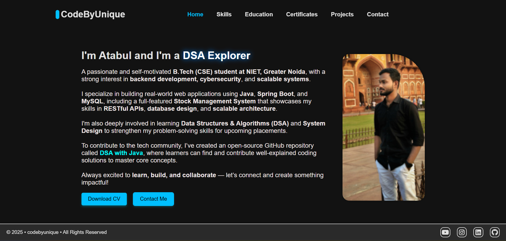
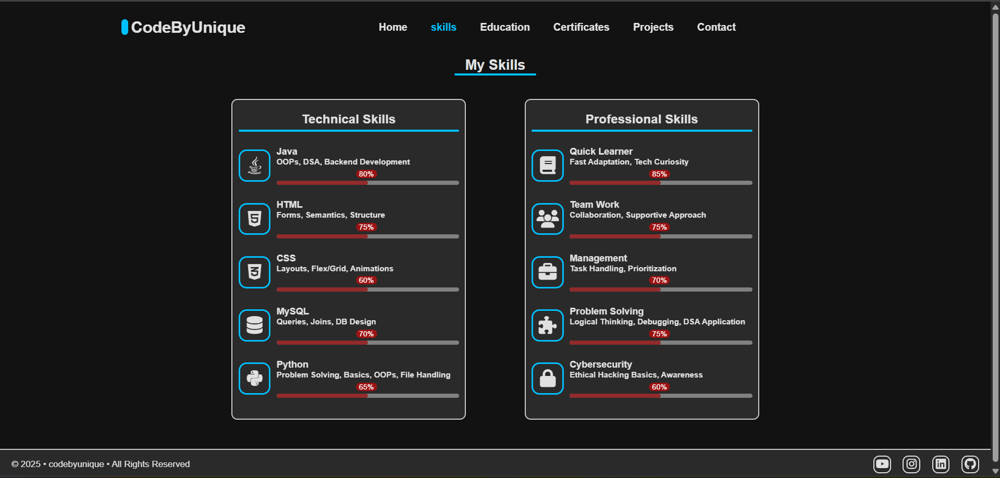
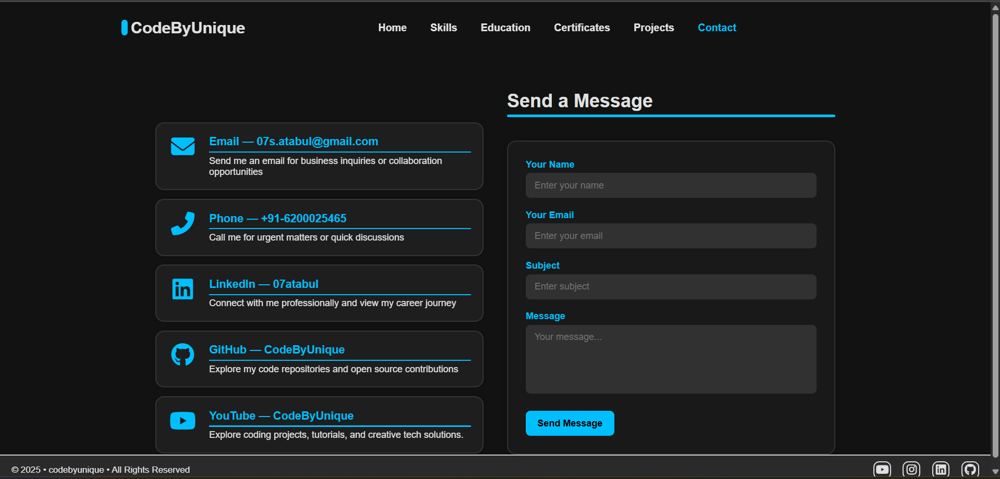

<h1 align="center">🚀 Faizan's Portfolio Website</h1>

<p align="center">
  <strong>A personal portfolio website to showcase my skills, projects, and achievements.</strong><br>
  <a href="https://688bd261239aec3b6611f4e4--regal-kashata-a47d14.netlify.app/" target="_blank">🌐 Live Website</a>
</p>

<p align="center">
  
</p>

---

## 🎨 Overview

**Faizan’s Portfolio** is a modern, responsive, and clean website designed to represent who I am as a developer and student. It includes sections that highlight my journey, technical skills, certifications, and the projects I've worked on. Built for both recruiters and peers to explore my work in one place.

---

## ✨ Features

- ✅ Fully Responsive (Mobile, Tablet, Desktop)
- 🎯 Clean and Minimal User Interface
- 🧑‍💻 Sections: Skills, Education, Certificates, Projects, Contact
- 📬 Contact Form with Formspree integration
- 🚀 Hosted on Netlify for fast and free deployment

---

## 🛠️ Tech Stack

| Markup | Styling | Icons | Deployment |
|--------|---------|-------|------------|
| HTML5  | CSS3    | Boxicons, FontAwesome | Netlify |

---

## 🖼️ Screenshots

| Skills Page                            | Contact Page                           |
|----------------------------------------|----------------------------------------|
|  |  |

---

## 📬 Contact Me

If you're a recruiter, collaborator, or just curious to connect, feel free to reach out via the [Contact Page](https://688bd261239aec3b6611f4e4--regal-kashata-a47d14.netlify.app/src/pages/contact.html).  
Let’s build something amazing together!

---

## 📄 License

This project is licensed under the **MIT License**.  
Feel free to use, modify, or contribute — just give credit where it's due.

```bash
© 2025 Faizan — All rights reserved
